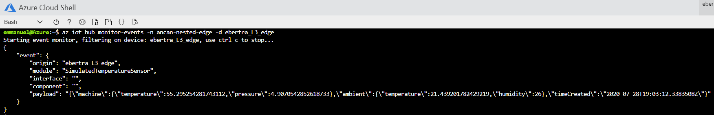
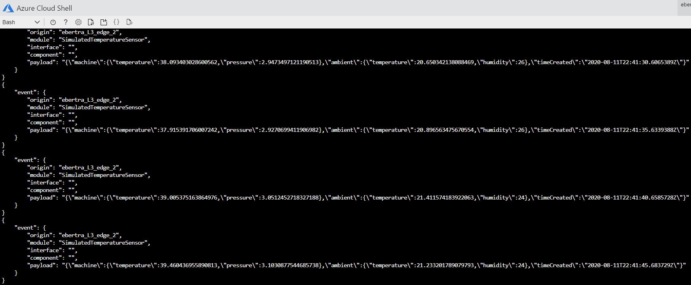

# Simulate a Purdue network and a hierarchy of IoT Edge devices
###### Part 1 - 30 mins

In this first part, we'll simulate in Azure a Purdue network, industrial assets and a hierarchy of IoT Edge gateways to acquire industrial data and upload it to the cloud securely without compromising the security of the network.


## Pre-requisites

- An **Azure account with a valid subscription**. When using the default simulation configuration, 7 Virtual Machines (VMs) and 1 Virtual Network (VNet) will be deployed in your subscription for a daily cost of **$3.54**. For more details, see this [Azure Pricing Estimate](https://azure.com/e/4df47d47440b43e78076078496e2c3d1).
- An **IoT Hub** that supports IoT Edge devices (F1 SKU --which is free--, S1, S2 or S3) in the same subscription.
- An **Azure Container Registry (ACR)** (Basic SKU --starting at $0.17/day, see [this page](https://azure.microsoft.com/en-us/pricing/details/container-registry/) for more pricing info-- or above) in the same subscription.
- An **SSH client**.
- **[Azure CLI](https://docs.microsoft.com/en-us/cli/azure/?view=azure-cli-latest) with the `azure-iot` CLI extension 0.10.6 or above** installed. We'll use a bash terminal from the [Azure Cloud Shell](https://docs.microsoft.com/en-us/azure/cloud-shell/overview) in this tutorial for which only a browser is needed.
    1. Open the [Azure Cloud Shell](https://shell.azure.com/) from your browser
    2. If you're using [Azure Cloud Shell](https://shell.azure.com/) for the first time, you'll be prompted to select a subscription to create a storage account and a Microsoft Azure Files share. Select Create storage to create a storage account for your Cloud Shell session information. This storage account is separate from resources used in this tutorial.
    3. Make sure that `azure-iot` CLI extension version `0.10.6` or above is installed in your Azure Cloud Shell:
        - Verify if the `azure-iot` extension is already installed and with which version:

            ```bash
            az --version
            ```

        - If not yet installed, add it:

            ```bash
            az extension add --name azure-iot
            ```

        - If an older version than `0.10.6` is installed, update it:

            ```bash
            az extension update --name azure-iot
            ```

    4. Verify that your are using the right subscription:

        ```bash
        az account show
        ```

    If you need to change subscription, use the `az account set -s=<your_subscription>` command.

## Simulate a Purdue network and a hierarchy of IoT Edge devices

### Deploy the simulation

To simulate a factory, the following scripts automate the deployment of a Purdue network, industrial assets and a hierarchy of IoT Edge gateways to acquire industrial data and upload their data securely without compromising the security of the Purdue Network.

From the [Azure Cloud Shell](https://shell.azure.com/):

- Download the scripts:

    ```bash
    git clone https://github.com/Azure-Samples/iot-edge-for-iiot.git
    ```

- Give execution permissions to these script:

    ```bash
    cd ./iot-edge-for-iiot
    find  -name '*.sh' -print0 | xargs -0 chmod +x
    ```

- Provide credentials for IoT Edge devices to access your Azure Container Registry (ACR):

    ```bash
    code ACR.env
    ```

- Unless you already have a SSH key pair, create one to connect to machines in your simulated Purdue network (To learn more about SSH key pairs, read [this documentation](https://docs.microsoft.com/azure/virtual-machines/linux/mac-create-ssh-keys)):

    ```bash
    ssh-keygen -m PEM -t rsa -b 4096
    ```

- Customize your simulation or keep the default settings that deploys 3 IoT Edge devices in layers L5, L4 and L3:

    ```bash
    code config.txt
    ```

    Here are some notes to change the default configuration:

    - The network layers are fixed
    - You can add as many IoT Edge devices as you want in each layer by listing out additional IoT Edge device names separated by a space
    - Define the parents of each nested IoT Edge device by appending their parent name under parenthesis
    - Follow the naming restrictions listed in the configuration file
    - Optionally, modify deployment files that go through each layers

    We'll assume that you're using the default configuration in the rest of this sample.

- Deploy the simulation (~15 minutes):

    ```bash
    ./install.sh -rg=<resource_group_prefix> -l=<location> -hubrg=<iothub_resource_group> -hubname=<iothub_name>
    ```

    The installation script deploys the following resources:

    - A Virtual Network (VNet) with one subnet per layer and network security rules enforcing the Purdue Model restrictions.
    - One Virtual Machine (VM) for the jumpbox, the observation point to access any devices on the network.
    - Two VMs running HTTP forward proxies: one in the IT DMZ and one in the OT DMZ.
    - One VM per IoT Edge device listed in the configuration file, e.g. 3 by default.
    - One VM per industrial asset listed in the configuration file, e.g. 1 by default.

    The reminder of the installation scripts provisions the IoT Edge devices in your IoT hub, configures the IoT Edge devices by installing test certificates and updating their IoT Edge configuration files, locks down the network so that VMs no longer have internet access once they are done with their configuration scripts (that comes from the internet) and finally deploys base workloads to IoT Edge devices via IoT hub.

    By default, *Azure VM B1ms* are used for all the VMs, e.g. 1vCPU, 2Gb RAM, 4GB storage VMs. To simulate heavy loads or *Azure VM B1ms* are not responsive enough for you, upgrade to more powerful VMs by passing the *vmSize* parameter to the installation script such as `vmSize=Standard_D3_v2`.

    By default, it uses a SSH public key located at `~/.ssh/id_rsa.pub`. To use a different key, pass the *sshPublicKeyPath* parameter to the installation script.

    Take note of all the outputs of the installation scripts since it lists key information on your network structure and on access information for all your VMs.

- Monitor your deployment. For each IoT Edge device, verify that after a couple of minutes all their modules are in `runningStatus` reported as `running`. Either by looking at your IoT Edge devices in t[he Azure portal](https://ms.portal.azure.com/?feature.canmodifystamps=true&Microsoft_Azure_Iothub=development#home) or by running the following Azure CLI command:

    ```bash
    az iot hub module-twin show --device-id <edge_device_id> --module-id '$edgeAgent' --hub-name <iot_hub_name> --query "properties.reported.[systemModules, modules]"
    ```

You now have a Purdue network simulated in Azure along with some IoT Edge devices deployed through a couple layers with a base deployment.

### Access your devices

Even though you should not need to directly access your IoT Edge devices, it may be convenient to do so just for education purposes. Given that the Purdue network is isolated from the Internet, an observation point has been added to this network to access devices. This observation point is called a jump box and it enables you to access any devices on the network. The jump box is not part of the Purdue model and has only been added for education purposes.

To access a device in the network, first connect to the jump box via SSH and from there connect to any other device on the network via SSH again. All the SSH handlers are provided by the installation script so that you only need to copy / paste values from there. A SSH key pair has also been automatically installed between the jump box and the VMs within the network to simplify their access, e.g. no password is needed.

From the [Azure Cloud Shell](https://shell.azure.com/) (on which you installed an SSH key to access the jump box):

- Connect to your jump box:

    ```bash
    <jumpbox_ssh_handle_from_the_installation_script>
    ```

- From the jump box, connect to any other device on the network:

    ```bash
    <iot_edge_device_ssh_handle_from_the_installation_script>
    ```

## Test your hierarchy of IoT Edge devices with a test workload

To deploy workloads to IoT Edge devices anywhere in the hierarchy, you can use the standard tools available to deploy an IoT Edge module: [Portal](https://docs.microsoft.com/en-us/azure/iot-edge/how-to-deploy-modules-portal), [CLI](https://docs.microsoft.com/en-us/azure/iot-edge/how-to-deploy-modules-cli), [VS Code](https://docs.microsoft.com/en-us/azure/iot-edge/how-to-deploy-modules-vscode).

As an example, we'll add this [Simulated Temperature Sensor](https://azuremarketplace.microsoft.com/en-us/marketplace/apps/azure-iot.simulated-temperature-sensor?tab=Overview) module to the `L3-edge` device from the above sample using the Azure Portal:

- Open and sign-in into the [Azure Portal](http://portal.azure.com)
- Navigate to your IoT Hub.
- On the left pane, under **Automatic Device Management**, select **IoT Edge**.
- Select `L3-edge` the IoT Edge device that is to receive the deployment.
- On the upper bar, select **Set Modules**.
- In the **IoT Edge Modules** section, click **Add**, and select **Marketplace Module** from the drop-down menu.


- Choose the **Simulated Temperature Sensor** module from the IoT Edge Module Marketplace page.
- Click on its name to edit its settings
- Under *Module Settings*, replace its **imageURI** to `$upstream:443/azureiotedge-simulated-temperature-sensor:1.0`
- Click on **Review+Create** and **Confirm**

An updated deployment is now on-going for `L3-edge` device.

Note: The Simulated Temperature Sensor only sends 500 messages by default. To change this behavior, set the environment variable `MessageCount` to the number of messages that should be sent or to `-1` to send messages indefinitely.

## View generated data

In this first part, you've created a hierarchy of IoT Edge devices across a Purdue network organized in hierarchical layers where only the top layer has connectivity to the cloud and the lower layers in the hierarchy can only communicate with adjacent north and south layers. Then, you've remotely deployed the **Simulated Temperature Sensor** module that sends simulated data from the lowest layer.

To view this simulated data making its way through the device hierarchy all the way up to the cloud, start monitoring the messages received by the cloud coming from the device in your lowest layer `L3-edge`. From the [Azure Cloud Shell](https://shell.azure.com/):

```bash
az iot hub monitor-events -n <iothub_name> -d L3-edge
```



## Simulate an internet outage

Let's simulate an internet outage. To do that, we'll disconnect the IoT Edge devices in the top layer (L5) from the internet by setting up a network firewall rule.

From the [Azure Cloud Shell](https://shell.azure.com/), launch the `goOffline` script with the parameters below. The name of your network resource group is made of your resource group prefix given above appended with the string "-RG-network":

```bash
./scripts/goOffline.sh -b=true -nrg=<name_network_resource_group> -hubname=<iot_hub_name>
```

Once the script has completed, all IoT Edge devices in the top layer no longer are connected to the internet. Please allow a minute or two for each edgeHub to restart, which is required to apply the network changes.

To verify that messages are no longer being received by IoT Hub, look at the monitoring job set up in the previous section and observe that no more messages are being received.

Let's now assume that the outage is resolved and that the IoT Edge devices in the top layer can go back online. From the [Azure Cloud Shell](https://shell.azure.com/):

```bash
./scripts/goOffline.sh -b=false -nrg=<name_network_resource_group> -hubname=<iot_hub_name>
```

After a couple of minutes, observe that the messages accumulated by IoT Edge devices in the top layer while offline are now being received by IoT Hub by looking at the monitoring job set up in the previous section.



Optionally, you can remove this simulated temperature sensor workload before moving on to the next part.

## Troubleshoot

The same troubleshooting guidelines to [diagnose issues for single IoT Edge node](https://docs.microsoft.com/en-us/azure/iot-edge/troubleshoot) or [resolve common errors](https://docs.microsoft.com/en-us/azure/iot-edge/troubleshoot-common-errors) are applicable. Below are some extra tips specific to nested IoT Edge devices.

### Twin reported properties

You can verify the proper set up of the installation by monitoring the edgeAgent module twin as described in [this tutorial](https://docs.microsoft.com/en-us/azure/iot-edge/how-to-monitor-module-twins). To get the latest edgeAgent module twin, run the following command from the [Azure Cloud Shell](https://shell.azure.com/):

```bash
az iot hub module-twin show --device-id <edge_device_id> --module-id '$edgeAgent' --hub-name <iot_hub_name> --query "properties.reported.[systemModules, modules]"
```

This command will output all the edgeAgent [reported properties](https://docs.microsoft.com/en-us/azure/iot-edge/module-edgeagent-edgehub). Here are some helpful ones to monitor the status of the device: *runtime status*, *runtime start time*, *runtime last exit time*, *runtime restart count*.

### Ping direct method

Once a device has been setup properly on the network, they can regularly query its status by pinging it. To do so, they can use [this ping directMethod](https://docs.microsoft.com/en-us/azure/iot-edge/how-to-edgeagent-direct-method#ping).

### Run the `check` command

If you have an SSH connection open on a device, you can run the `iotedge check` command documented [here](https://docs.microsoft.com/en-us/azure/iot-edge/troubleshoot#run-the-check-command).

This check tool runs a connectivity check and will give warning in case there is an issue. For devices in lower layers, you need to specify where can the `iotedge check` tool find the `diagnostics` container image by using the following parameter:

```bash
sudo iotedge check --diagnostics-image-name azureiotedge-diagnostics:1.2.0-rc4
```

### Collect logs

To look at a device logs, you can:

- *If the device has connectivity to IoT Hub*: Remotely pull all the containers logs of a device by summoning the `UploadLogs` direct method per [these instructions](https://github.com/Azure/iotedge/blob/master/doc/built-in-logs-pull.md).
- *If the device does not connectivity to IoT Hub*: SSH into the IoT Edge VM and collect all available IoT Edge logs from that device by running the `iotedge support-bundle` command on the device. [Full instructions available here](https://docs.microsoft.com/en-us/azure/iot-edge/troubleshoot#gather-debug-information-with-support-bundle-command).

## Clean up

Don't clean up resources created in this part yet if you plan on continuing to the next part. Otherwise, clean them up by running the following script from the [Azure Cloud Shell](https://shell.azure.com/) (it may take a while):

```bash
./uninstall.sh -rg=<resource_group_prefix> -hubrg=<iothub_resource_group> -hubname=<iothub_name>
```

This script deletes all the resources that you've deployed in Azure for this simulation, including the IoT Edge devices created in your IoT Hub. Container images automatically copied with the installation script will still be part of your Azure Container Registry (ACR).

## Next step

Now that you have all the edge infrastructure deployed in a simulated factory, let's deploy workloads to connect and monitor industrial assets in the next part:

- [Deploy workloads to collect, store and visualize data from IIOT assets](2-DeployOfflineDashboard.md) (30 mins)

