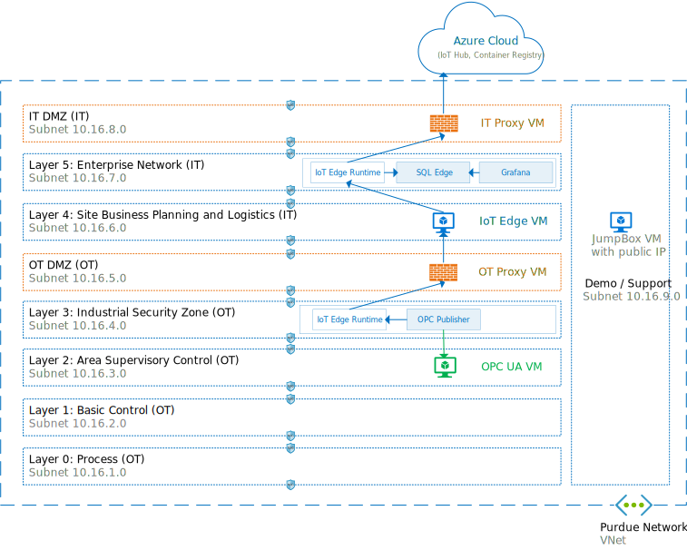
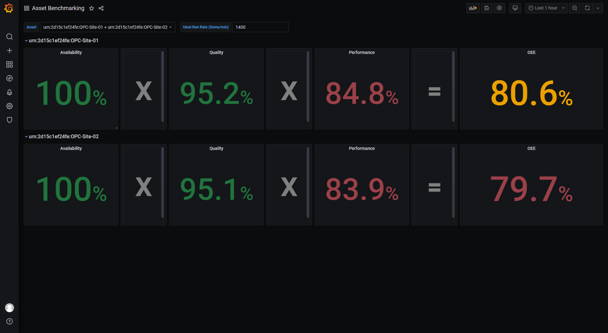
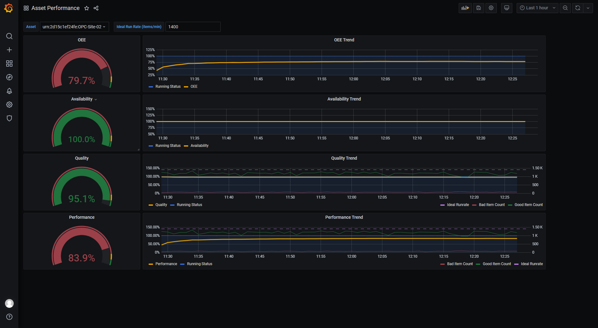

# Deploy workloads to collect, store and visualize data from industrial assets
###### Part 2 - 30 mins

In this second part, we'll remotely deploy workloads to IoT Edge devices in order to 1/collect data from industrial assets over [OPC UA](https://opcfoundation.org/about/opc-technologies/opc-ua/) with [OPC Publisher](https://azuremarketplace.microsoft.com/marketplace/apps/microsoft_iot.iotedge-opc-publisher?tab=Overview), 2/store this data in a local [SQL Edge](https://azure.microsoft.com/services/sql-edge/) database and 3/visualize this data locally even when offline. We'll build these workloads using a [CI/CD](https://wikipedia.org/wiki/CI/CD) pipeline with [Azure DevOps](https://azure.microsoft.com/services/devops/).



## Solution architecture

This solution uses IoT Edge as the deployment and messaging infrastructure described in the first part. In this second part, 3 [IoT Edge modules](https://docs.microsoft.com/azure/iot-edge/iot-edge-modules?view=iotedge-2018-06) are built and deployed for this local monitoring use case:
- **[OPC Publisher](https://azuremarketplace.microsoft.com/marketplace/apps/microsoft_iot.iotedge-opc-publisher?tab=Overview)** is an open-source module built by the Azure Industrial IoT team to collect data from OPC UA servers. It is configured with a configuration file embedded in the module built by the DevOps pipeline. To learn more about the configuration of the OPC Publisher module, see [this documentation](https://docs.microsoft.com/azure/iot-accelerators/howto-opc-publisher-configure#use-configuration-files).
- **[SQL Edge](https://azure.microsoft.com/services/sql-edge/)** is an time-series database built specifically for the edge by the Azure SQL team. It stores telemetry data locally that can then be queried by Grafana.
- **[Grafana](https://grafana.com/)** is an open-source dashboarding tool for visualizing device telemetry.

## Pre-requisites

- **[Part 1 completed](1-SimulatePurdueNetwork.md)** with resources still available.
- An Azure DevOps project that will be used to host your [Azure DevOps pipeline](https://docs.microsoft.com/azure/devops/pipelines/get-started/what-is-azure-pipelines?view=azure-devops). Devops pipeline is used to enable a continuous, repeatable development, build, and deployment process, as well as having the ability to test the deployment to multiple IoT Edge devices at scale. To set up your DevOps project:
    - [Sign-in to Azure DevOps](https://go.microsoft.com/fwlink/?LinkId=307137) and make sure your account belongs to an organization. To learn more, see these [instructions](https://docs.microsoft.com/en-us/azure/devops/organizations/accounts/create-organization?view=azure-devops).
    - Create your DevOps project by following the instructions on this [website](https://docs.microsoft.com/en-us/azure/devops/organizations/projects/create-project?view=azure-devops&tabs=preview-page) but skip the 'Add a Repository to your Project' part because we'll be using GitHub instead.
    - Install [GitVersion](https://marketplace.visualstudio.com/items?itemName=gittools.usegitversion) in your DevOps organization by clicking on the `Get it free` button. This pextension is used to automatically derive image version tags from a repository.
    - Create a service connection to Azure to allow DevOps to push images and create deployments in your Azure subscription.
        - From the left navigation of your DevOps project, choose `Project Settings` in the bottom corner
        - Under `Pipelines`, choose `Service Connections`
        - Click `New Service Connection`
        - Choose `Azure Resource Manager` and hit `Next`
        - Choose `Service Principal (automatic)` and hit `Next`
        - Choose the `Azure subscription` that you used in part 1 and leave the Resource group dropdown empty (we need access to all the resource groups created in part 1)
        - Name your service connection `azureServiceConnection` and hit `Save`
    - Fork [this GitHub repo](https://github.com/Azure-Samples/iot-edge-for-iiot) by opening up this repo and clicking on `Fork` in the top-right corner. DevOps require your own workspace so that you can make changes to the pipeline configuration.
 

## Create the DevOps pipeline

To create your DevOps pipeline, follow these steps from your DevOps project page:

- From the left menu, click on `Pipelines` and select `New pipeline`.
- From the "Where is your code?" screen, choose `GitHub`.
- You may see a screen asking for authentication: `Authenticate to authorize access`
- From the "Select a repository" screen, select the fork created above
- Select `Approve and Install Azure Pipelines` if required
- From the "Configure your pipeline" screen, select `Existing Azure Pipelines YAML file`
- Select the branch `master`, path `/offline-dashboards/azure-pipelines.yml` and hit `Continue`
- From the "Review your pipeline YAML" screen, select `Variables`, hit `New variable` and create the following variables:
    - AZURE_SERVICE_CONNECTION: `azureServiceConnection`, which is the name of the Azure service connection created above
    - AZURE_SUBSCRIPTION_ID: Your Azure subscription ID
    - IOT_HUB_NAME: Your IoT Hub name used in part 1 (short name, without the .azure-devices.net)
    - ACR_RESOURCE_GROUP: The name of the resource group with your Azure Container Regsitry (ACR) used in part 1
    - ACR_NAME: Short name of your ACR used in part 1 (e.g. the part before .azurecr.io)
    - ACR_USERNAME: Your ACR username
    - ACR_PASSWORD: Your ACR password
    - IIOT_ASSETS_RG: Name of resource group where IIOT assets, aka the OPC servers, were created in part 1.
    - SQLEDGE_ADMIN_PASSWORD: The desired administrator (SA) password for your SQL Edge instance. It must be a password of at least 8 characters and contain characters from three of the following four sets: uppercase letters, lowercase letters, base 10 digits, and symbols.
    - GRAFANA_ADMIN_PASSWORD: The desired administrator password for your Grafana dashboard web app.
    
- From the "Review your pipeline YAML" screen, click the down-arrow next to Run and click "Save"

## Run the pipeline

The pipeline is set to trigger on commits to the master branch's offline-dashboards folder of your GitHub repository. However for testing purposes, it can be run manually.

Go to your pipelines page, click on your pipeline and hit "Run pipeline" in the upper right corner to start the manual execution of the pipeline. The pipeline has "Build" and "Release" stages. Click on the "Build" stage to open the detail view while running.

Once the pipeline is executed (~15 mins), all IoT Edge modules have been built and pushed to your Azure Container Registry. Two layered deployments have also been created in your IoT Hub. Layered deployments help to manage  modules at scale by automatically deploying modules to any registered devices that meets a set of defined condition (such as tags). To learn more about layered deployment, please visit [this documentation](https://docs.microsoft.com/en-us/azure/iot-edge/module-deployment-monitoring?view=iotedge-2018-06).

To verify the IoT Edge modules built, navigate to your Azure Container Registry in the [Azure Portal](https://portal.azure.com/) and verify that there are now images in the following repositories:
  - offline-dashboards/grafana
  - offline-dashboards/opcpublisher
  - offline-dashboards/sqledge

To verify that the layered deployments were successfully created, navigate to your IoT Hub instance in the [Azure Portal](https://portal.azure.com/), select `Automatic Device Management`>`IoT Edge` from left navigation, select `IoT Edge deployments` and verify that the following two layered deployments exist:
  - dashboard-node
  - publisher-node

## Deploy workloads

In order to deploy modules you need to set relevant tags on the edge devices so that layered deployments get applied to them.

### OPC Publisher

The layered deployment called `publisher-node` contains the deployment artifacts for the OPC Publisher module. It is needs to be applied to the IoT Edge devices that can connect to OPC UA servers, e.g. in newtork layer L2 in this sample.

To apply this layered deployement to IoT Edge device `L3-edge`, run the following Azure CLI command in the [Azure Cloud Shell](https://shell.azure.com/):

```bash
az iot hub device-twin update --device-id L3-edge --hub-name <iothub_name> --set tags='{"publisherNode": true}'
```

### SQL Edge and Grafana

The layered deployment called `dashboard-node` contains the deployment artifacts for both SQL Edge and Grafana modules. It is typically applied to the IoT Edge devices in the top-most network layer.

To apply this layered deployement to IoT Edge device `L5-edge`, run the following Azure CLI command in the [Azure Cloud Shell](https://shell.azure.com/):

```bash
az iot hub device-twin update --device-id L5-edge --hub-name <iothub_name> --set tags='{"dashboardNode": true}'
```

To verify that the layered deployments have been properly picked up, go to the [Azure Portal](https://portal.azure.com/), navigate to "Automatic Device Management">"IoT Edge">"IoT Edge Deployments" and make sure both deployments show "1 Targeted" and "1 applied" under "System Metrics" column. You can also verified the module deployment status of each device by running the CLI command provided in [this section in part 1](1-SimulatePurdueNetwork.md#twin-reported-properties).

## View the dashboards

To view the dashboards, wait for a couple of minutes for all modules to be running and then from your browser:

  - Navigate to the address `http://{jumpbox-FQDN}:3000/` .
  - Login with the username `admin` and the password that you've set in your DevOps pipeline
  - Click on the `Home` button in the top left corner and select one of the three pre-built dashboard:
      - `Asset Benchmarking`
      - `Asset Performance`
      - `Production at a glance`

Here is a sneak peek at each of these dashboards:
- Asset Benchmarking:



- Asset Performance:



- Production at a glance:


## Next step

Now that you have all the edge infrastructure deployed in a simulated factory and workloads deployed to connect and monitor industrial assets, let's monitor the health of these systems from the cloud:

- [Monitor your IoT Edge devices from the cloud](3-Monitor.md) (30 mins)

If you want to learn more about the dashboard solution that we have just set up, please look at [this repository](https://github.com/AzureIoTGBB/iot-edge-offline-dashboarding/blob/master/documentation/customize-sample-oee.md).
## Clean up

Don't clean up resources created in this part yet if you plan on continuing to the next part. Otherwise, clean all the resources created in part 1 by running the following script from the [Azure Cloud Shell](https://shell.azure.com/) (it may take a while):

```bash
./uninstall.sh -rg=<resource_group_prefix> -hubrg=<iothub_resource_group> -hubname=<iothub_name>
```

This script deletes all the resources that you've deployed in Azure for this simulation, including the IoT Edge devices created in your IoT Hub. Container images automatically copied with the installation script or created by the DevOps pipeline will still be part of your Azure Container Registry (ACR).

Delete the layered deployment in your IoT Hub created by your DevOps pipeline:

```bash
az iot edge deployment delete --deployment-id dashboard-node --hub-name <iothub-name>
az iot edge deployment delete --deployment-id publisher-node --hub-name <iothub-name>
```

Delete your DevOps project by going to `Project Settings` > `General` > `Overview` > `Delete`. 
 

<br>
<br>
<br>

----

<br>

## APPENDIX

### Configuration of the OPC Publisher module

The DevOps pipeline builds a publishedNodes.json file that looks at all VMs in L2 level, under the assumption that all these VMs are OPC UA servers. It then embeds this file in to OPC Publisher module image, which is the same image to be used in all publisher nodes. Therefore if you have more than one publisher node, all of them will collect same data. To set one OPC Publisher to only collect data from specific OPC UA servers, follow those steps:
- Access to published nodes file at /app/pn.json path in the OPC Publisher image. You may run below docker command to copy file from module image into Edge VM

    ```bash
    sudo docker cp opcpublisher:/app/pn.json ./publishedNodes.json
    ```
- Copy/modify relevant portions top create your own published nodes file (e.g pn1.json)
- Create a directory (/iiotedge)
- Copy you published nodes file (pn1.json) into /iiotedge
- Repeat above for every publisher node
- Modify layered deployment template as following 

```json
{
  "Hostname": "publisher",
  "Cmd": [
    "--pf=/appdata/pn1.json",
    "--aa",
    "--loglevel=verbose"
  ],
  "HostConfig": {
    "Binds": [
      "/iiotedge:/appdata"
    ]
  }
}
```

### Configuration of the simulated OPC UA servers

Though the OPC Simulator image is built by the DevOps pipeline, a fixed version is deployed to simulated OPC UA servers in part 1 that is located on Docker Hub at onderyildirim/opcsimulator:0.1.50.0-amd64.

The source code of this simulated OPC UA server is available in this repository. It is built on [Node-Red](https://nodered.org/). The Docker command to run it is available in the ./script/opcua/cloud-init file.

If you want to update this simulated OPC UA server, for instance to simulate another dataset, you'll need to first update the Network Security Group (NSG) to allow internet connectivity in L2 network layer, deploy and run the updated OPC Simulator container and re-lockdown the NSG in L2.

### Dashboard queries and database schema

See [SQL query reference](./offline-dashboards/sql-query-reference.md) for more information on queries used in dashboards and SQL Edge database schema.
