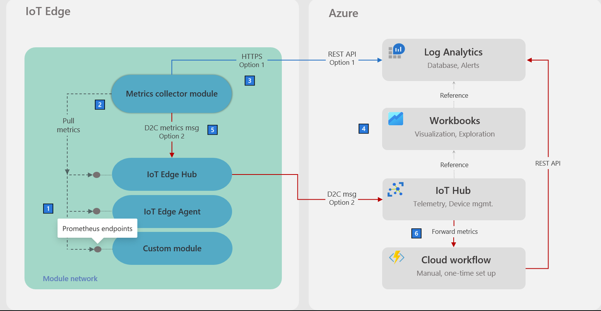
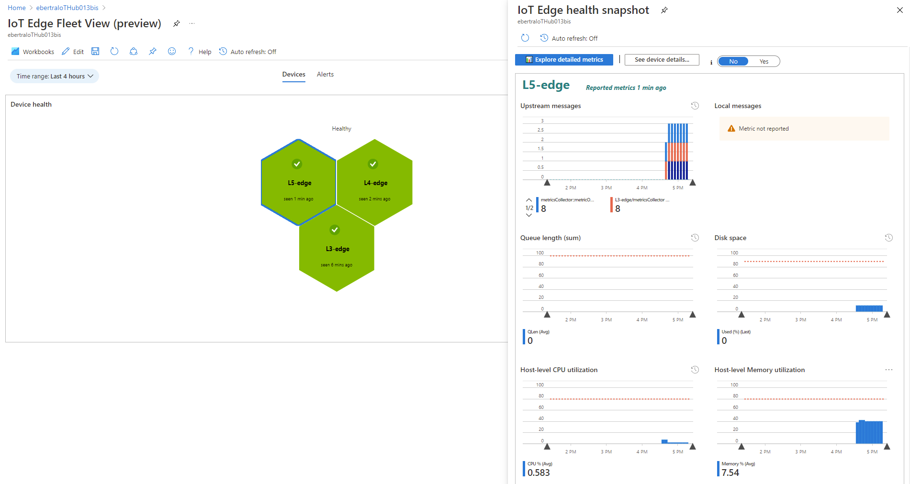
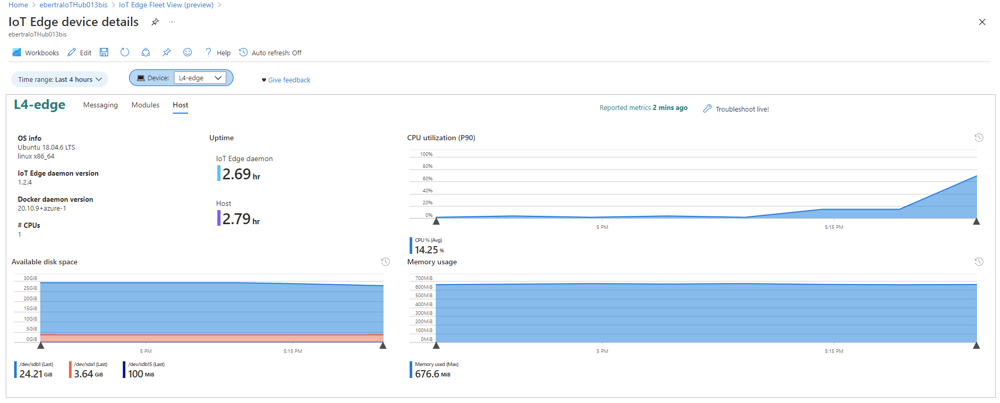

# Monitor your IoT Edge devices from the cloud
###### Part 3 - 30 mins

In this third part, we'll remotely deploy an additional workload to your IoT Edge devices and deploy an additional cloud workflow in order to 1/collect metrics from your IoT Edge devices independently from the network layer that they are in and 2/visualize these metrics from a single cloud dashboard and 3/setup alerts in the cloud. This capability comes in addition to the ability to remotely collect logs from all your IoT Edge devices as already seen in [part 1 - Collect logs](1-SimulatePurdueNetwork.md#collect-logs).

## Solution architecture

This solution uses IoT Edge as the deployment and messaging infrastructure as described in the first part and Azure Monitoring. A Log Analytics workspace and [cloud workflow](https://github.com/Azure-Samples/iotedge-logging-and-monitoring-solution) is first created to ingest and store metrics sent by devices. Next, the[ IoT Edge metrics collector module](https://azuremarketplace.microsoft.com/en-us/marketplace/apps/microsoft_iot_edge.metrics-collector?tab=Overview) is added to all IoT Edge devices to collect metrics. Finally, these metrics are visualized in a cloud dashboard. To learn more about this architecture, please visit [this documentation](https://docs.microsoft.com/en-us/azure/iot-edge/how-to-collect-and-transport-metrics?view=iotedge-2020-11&tabs=iotcentral).



## Pre-requisites

- [Part 1 completed](1-SimulatePurdueNetwork.md) with resources still available.
- [PowerShell](https://docs.microsoft.com/en-us/powershell/scripting/install/installing-powershell?view=powershell-7.1).

 
## Create a Log Analytics workspace and cloud workflow

[Azure Monitor](https://docs.microsoft.com/en-us/azure/azure-monitor/) is a set of services to monitor Azure and on-prem services. [Log Analytics](https://docs.microsoft.com/en-us/azure/azure-monitor/logs/log-analytics-overview) is a tool in the Azure portal used to query data in Azure Monitor. We'll create a Logs Analytics workspace to store and query all the metrics collected by IoT Edge devices (To read the full tutorial, please see t[his documentation](https://docs.microsoft.com/en-us/azure/azure-monitor/logs/quick-create-workspace)).

In the nested configuration, since Azure Monitor can't be reached directly by nested devices, metrics are sent as regular messages to IoT Hub (via one more IoT Edge gateway). A cloud workflow is then required to route these metrics messages to an Azure Function that pushes them to Log Analytics.

Instead of configuring this setup manually, we'll use [this sample tool](https://github.com/Azure-Samples/iotedge-logging-and-monitoring-solution) to automatically deploy it:

1. Clone this repository:

    ```bash
    git clone https://github.com/Azure-Samples/iotedge-logging-and-monitoring-solution.git
    ```

2. Deploy the solution:

    ```
    cd iotedge-logging-and-monitoring-solution\
    .\Scripts\deploy.ps1
    ```

3. Choose the following options during the deployment:
    - **Custom deployment** as a deployment option
    - Choose a resource group of your choice to host this solution
    - **Use existing IoT Hub** and select your IoT Hub with your nested devices
    - **Enable IoT Edge monitoring**
    - **Upload metics as IoT messages**

4. Copy the value of the `ResourceID` from the deployment manifest sample provided by the script. We'll use it when deploying the metrics collector module in the next section

That's it! The script should complete with a `Deployment suceeded` message. Our cloud workflow to manage metrics is now operational.


## Deploy the metrics collector module

### Import the metrics collector module in your ACR

Because the metrics collector module is a module that we have not used so far and that in nested configurations, all module images must come from the same container registry, we need to add it to our Azure Cloud Registry (ACR). We'll do that by running the following command:

```
az acr import --name <acr_name> --force --source mcr.microsoft.com/azureiotedge-metrics-collector:1.0 --image azureiotedge-metrics-collector:1.0
```

### Create layered deployments

We'll create two [layered deployment](https://docs.microsoft.com/en-us/azure/iot-edge/module-deployment-monitoring?view=iotedge-2020-11#layered-deployment) to have a long running job that will deploy the metrics collector module to all IoT Edge devices that have the tag `metricsCollector` if in the top network layer or the tag `metricsCollectorNested` if in a nested network layer. Tagging of IoT Edge devices is done in the next section.

To create the first layered deployment for devices in the top layer, from the [Azure Cloud Shell](https://shell.azure.com/):

- Go to the cloned repo folder:

    ```bash
    cd ~/iot-edge-for-iiot/
	```

- Update the values in the `monitor/metricsCollector-top.layered.deployment.json` file (for more details on these fields, see [this documentation](https://docs.microsoft.com/en-us/azure/iot-edge/how-to-collect-and-transport-metrics?view=iotedge-2020-11#metrics-collector-configuration)):
    - `ResourceID`: Resource id of your IoT Hub. This is the value that we copied in the previous section. See [this documentation](https://docs.microsoft.com/en-us/azure/iot-edge/how-to-collect-and-transport-metrics?view=iotedge-2020-11#resource-id) for more info on this field.

- Replace the IoT Hub name with yours and run this command to create the layered deployment with the metrics collector module

    ```bash
    az iot edge deployment create --hub-name <iothub_name> --deployment-id metrics-collector --content ./monitor/metricsCollector-top.layered.deployment.json --target-condition "tags.metricsCollector=true" --priority 9 --layered true
    ```

To create the second layered deployment for devices in lower layers, from the [Azure Cloud Shell](https://shell.azure.com/):

- Update the values in the `monitor/metricsCollector-nested.layered.deployment.json` file (for more details on these fields, see [this documentation](https://docs.microsoft.com/en-us/azure/iot-edge/how-to-collect-and-transport-metrics?view=iotedge-2020-11#metrics-collector-configuration)):
    - `ResourceID`: Resource id of your IoT Hub. This is the value that we copied in the previous section. See [this documentation](https://docs.microsoft.com/en-us/azure/iot-edge/how-to-collect-and-transport-metrics?view=iotedge-2020-11#resource-id) for more info on this field.

- Replace the IoT Hub name with yours and run this command to create the layered deployment with the metrics collector module

    ```bash
    az iot edge deployment create --hub-name <iothub_name> --deployment-id metrics-collector-nested --content ./monitor/metricsCollector-nested.layered.deployment.json --target-condition "tags.metricsCollectorNested=true" --priority 9 --layered true
    ```

To verify that the layered deployments were successfully created, navigate to your IoT Hub instance in the [Azure Portal](https://portal.azure.com/), select `Automatic Device Management`>`IoT Edge` from left navigation, select `IoT Edge deployments` and verify that the following the `metrics-collector` and `metrics-collector-nested` layered deployments exists.

### Tag all your IoT Edge devices

In order to deploy the metrics collector module to your IoT Edge devices, you need to set relevant tags on these devices so that this layered deployment gets applied to them. To tag your devices to get the metrics collector module, replace the IoT Hub name with yours and run the following Azure CLI commands in the [Azure Cloud Shell](https://shell.azure.com/):

```bash
az iot hub device-twin update --device-id L5-edge --hub-name <iothub_name> --set tags='{"metricsCollector": true}'
az iot hub device-twin update --device-id L4-edge --hub-name <iothub_name> --set tags='{"metricsCollectorNested": true}'
az iot hub device-twin update --device-id L3-edge --hub-name <iothub_name> --set tags='{"metricsCollectorNested": true}'
```

To verify that the layered deployments have been properly picked up, go to the [Azure Portal](https://portal.azure.com/), navigate to "Automatic Device Management">"IoT Edge">"IoT Edge Deployments" and make sure both deployments show "1 Targeted" and "1 applied" under "System Metrics" column. You can also verified the module deployment status of each device by running the CLI command provided in [this section in part 1](1-SimulatePurdueNetwork.md#twin-reported-properties). It may take a couple minutes for layered deployments to be applied.

## Visualize your metrics

To visualize the metrics sent by your IoT Edge device, we'll use pre-built workbooks. Go to your IoT Hub > Monitoring > Workbooks and select the `IoT Edge Fleet View (preview)` one. From there, drill down to one of your devices by clicking on one of your IoT Edge device name in the right column. Explore all the health details collected on this IoT Edge device. For more information about these workbooks, please see [this documentation](https://docs.microsoft.com/en-us/azure/iot-edge/how-to-explore-curated-visualizations?view=iotedge-2020-11&tabs=devices%2Cmessaging). 





You now have a cloud dashboard to remotely monitor the health of all your IoT Edge devices, independently from their network location.

## Going further

As a next step, you can also explore [this documentation](https://docs.microsoft.com/en-us/azure/iot-edge/how-to-create-alerts?view=iotedge-2020-11) to learn how to create alerts based on these metrics.

## Clean up

Clean all the resources created in part 1 by running the following script from the [Azure Cloud Shell](https://shell.azure.com/) (it may take a while):

```bash
./uninstall.sh -rg=<resource_group_prefix> -hubrg=<iothub_resource_group> -hubname=<iothub_name>
```

This script deletes all the resources that you've deployed in Azure for this simulation, including the IoT Edge devices created in your IoT Hub. Container images automatically copied with the installation script or created by the DevOps pipeline will still be part of your Azure Container Registry (ACR).

Also delete the resource group that you have used to set up monitoring resources:

```bash
az group delete --yes --name <resource_group_used_for_monitoring_resources>
```

Delete the layered deployment in your IoT Hub created by your DevOps pipeline in step 2:

```bash
az iot edge deployment delete --deployment-id dashboard-node --hub-name <iothub-name>
az iot edge deployment delete --deployment-id publisher-node --hub-name <iothub-name>
```

Delete your DevOps project by going to `Project Settings` > `General` > `Overview` > `Delete`. 

Delete the layered deployment in your IoT Hub created in step 3 to collect metrics:

```bash
az iot edge deployment delete --deployment-id metrics-collector --hub-name <iothub-name>
az iot edge deployment delete --deployment-id metrics-collector-nested --hub-name <iothub-name>
```