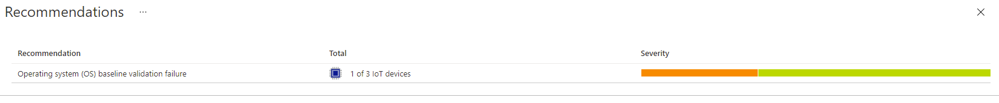

# Secure your devices with Defender for IoT
###### Part 3 - 15 mins

In this third part, we'll monitor the security of your fleet of IoT Edge devices by using Azure Defender for IoT. Defender for IoT is integrated with your IoT Hub and by installing a micro agent  on your IoT devices, Defender for IoT automatically provides depth security protection and visibility into device behavior. The micro agent installed on all IoT Edge devices collects, aggregates, and analyze raw security events from your devices and uploads them to IoT Hub. Based on these events, you can monitor the security of your devices and look at recommendations from a single dashboard in IoT Hub. To learn more about agent-based Defender for IoT solutions, please visit [this documentation](https://docs.microsoft.com/azure/defender-for-iot/architecture-agent-based).



## Pre-requisites

- **[Part 1 completed](1-SimulatePurdueNetwork.md)** with resources still available.

## Installation

Defender for IoT micro agent has already been installed on each IoT Edge devices by the script run in part 1.

From the [Azure Cloud Shell](https://shell.azure.com/) (on which you installed an SSH key to access the jump box):

- Connect to your jump box:
```bash
<jumpbox_ssh_handle_from_the_installation_script>
```

- From the jump box, connect to an IoT Edge device such as `L3-edge`:
```bash
<iot_edge_device_ssh_handle_from_the_installation_script>
```

- Verify proper installation of Defender for IoT micro agent:
```bash
sudo systemctl status defender-iot-micro-agent.service
```

Verify that it returns an `Active` status.

## Create a security incident

You can test the system from end to end by creating a trigger file on the device. The trigger file will cause the baseline scan in the agent to detect the file as a baseline violation.

Create a file on the file system with the following command:

```bash
sudo touch /tmp/DefenderForIoTOSBaselineTrigger.txt 
```

This should trigger a baseline validation failure recommendation.

## Monitor your security dashboard and recommendations

After up to an hour, your security dashboard in IoT Hub should now report a new baseline validation failure recommendation. To see it, go to your Azure Portal and navigate to yoru IoT Hub > Security > Recommendations.

A baseline validation failure recommendation will occur in the hub, with a CceId of CIS-debian-9-DEFENDER_FOR_IOT_TEST_CHECKS-0.0:

