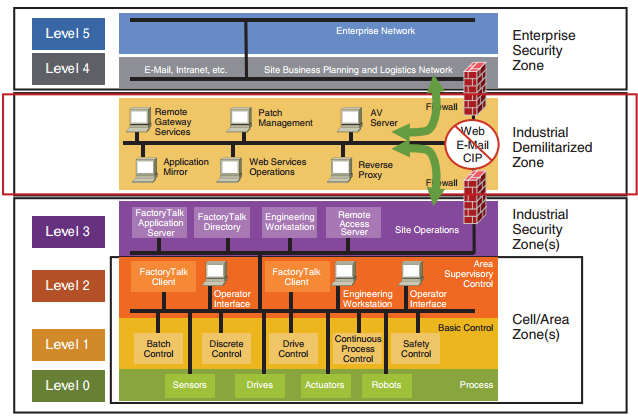

# Purdue Environment

Many industrial companies leverage the [Purdue network model](https://en.wikipedia.org/wiki/Purdue_Enterprise_Reference_Architecture) (included in the [ISA 95](https://en.wikipedia.org/wiki/ANSI/ISA-95) and [ISA 99](https://www.isa.org/standards-and-publications/isa-standards/isa-standards-committees/isa99) standards) to ensure their process control networks protect both the limited bandwidth of the network and the ability to offer real time deterministic behavior. In more recent years with cyber security events being on the climb from internal and external parties security teams look at the Purdue model as an additional layer of the defense in depth methodology. This introduced two additional "layers" that do not have numbers, but instead focus on the functional aspects of a network De-Militarized Zone (DMZ). One of the DMZ's is the Operational DMZ located between Layer 3 and Layer 4 with the other being the IT (or Enterprise) DMZ being positioned after Layer 5.

Each layer of this model represents a trust zone and no systems are to operate access a trust zone beyond a single layer difference. These trust zones are often controlled through typical networking constructs such as VLANs, firewalls etc. Although in its truest form this architecture does not allow internet access until Layer 5 some companies's IT departments are open to allowing access at Layer 4 through introduction of a security waiver or other process.

In the face of this network architecture it is important to understand how to implement software systems and solutions to offer a working, updatable and manageable deployment. The set of scripts provided in the first module of this repository and documentation has been offered as a way of both educating and validating these deployment strategies.

A common point of contention for IoT solutions that are being implemented in this model tie to the fact that OT related systems do not have internet access, this includes the SCADA or HMI. This results in the need to place IoT gateways and similar devices on the IT networks limiting their direct access to Layer 3 when communicating with devices. This layer has no access to perform direct reading, monitoring or supervisory control relying on all interactions to occur through site level aggregators homed in Layer 3.

There are some organizations that will allow for an "overlay network" that is focused on IoT devices and sensors, providing a collapsed model. Although this is in itself a relief to many solution implementers as it resolves the access issue, it also has the following negative results.

- Any interactions between a device and the internet is another attack surface, introducing a potential point of failure for the perceived "unassociated network". As an example if the overlay device is hacked a bad actor could cause the device to perform a series of transition changes either flooding the real time network with alerts or resulting in unexpected device states for the other network devices hosed on the real time network.
- Additional management and auditing must be performed on the overlay network, driving up operational costs while adding additional attack surfaces to the threat model.
- The devices on the overlay network do not normally have access to the same volumes of data which may result in a need to still access OT hosted devices.
- Care must be taken when applying an overlay network to make sure that there are not conflicts on read rates, subscriptions or bus messaging volumes due to the dual interrogation system.

Overlay networks are most often setup as read only data taps to feed additional solutions that cannot access the process control network. 

## Purdue Network Model

The Purdue network layers were originally introduced as a best practice for maintaining performance and deterministic behavior on the process control network. In later times the same model was identified as a security best practice where a firewall could be placed between each layer of the network model, resulting in each layer being "a trust zone".



### Layer 0: Process (OT)

Processing equipment that is being controlled and monitored is located in this subnet. Examples of devices found in this subnet include pumps, valves and sensors.

Things in this layer must operate fast and smoothly, often low bandwidth with real time requirements.

### Layer 1: Basic Control (OT)

The equipment that monitors and controls the devices found in Layer 1 are found in this subnet. Examples of equipment in this layer include Programmable Logic Controllers (PLCs), Variable Frequency Drives and proportional-integral-derivative controllers. Equipment found in this layer are typical direct control and direct monitoring. PLC's in this layer are not supervisory in nature.

### Layer 2: Area Supervisory Control (OT)

Systems and equipment found in this layer are often responsible for supervisory control and monitoring functions. Examples of this equipment include single machine or small area (production line etc.) HMIs and SCADA systems, system clients and engineering monitoring systems and workstations can be found here.

### Layer 3: Industrial Security Zone (OT)

This layer supports plant wide control and monitoring functions. Operators interact with the overall production systems. An example of these systems can be HMI systems to perform quality control checks, manage uptime and surface alarms and alerts.

Systems may include database servers, file servers, historians etc.

### OT DMZ (OT)

This layer is similar to the IT DMZ but used to manage the flow of information between the OT and Enterprise network layers, preventing direct interactions. If something was to be compromised in the Enterprise network layers the OT DMZ could be shutdown as a fast mitigation.

This layer typically houses HTTP proxy servers, database replication servers and similar.  

### Layer 4: Site Business Planning and Logistics (IT)

This layer houses all of the IT systems that support the production process in a plant or facility. Typically these systems report production statistics such as uptime, units produced and OEE for corporate systems. Systems in this layer include database servers, application servers and MES servers.

### Layer 5: Enterprise Network (IT)

This network normally sits at a corporate level and span multiple facilities and plants. They take data from subordinate systems in the plants and facilities to make educated decisions that span the enterprise. 

### IT DMZ (IT)

This layer is the only layer that is allowed to directly access the internet. This is a traditional Enterprise DMZ, following common enterprise practices. 

### Key Points to Remember

- Layer 0 is typically a real time, deterministic network and should not be directly interacted with or process operations may be negatively impacted
- Layer 1 may have devices that are not aggregated in Layer 2 resulting in a need to directly interact with it. For the vast majority of solutions this is not required as the devices from this level that are not aggregated are typically beneath the radar for the majority of IoT solutions.
- Layer 2 systems are prime targets for data acquisition and control when building an IoT Solution. The challenge with this layer is that any of the layers with direct internet access cannot communicate with it as more than 1 trust zone transition is required. This typically requires some form of system to be deployed in Layer 3 to make it viable (similar to a reverse proxy in behavior).
- Layer 3 systems are the first layer of systems that are directly accessible to internet connected devices. The internet connected systems are deployed to Layer 4 with the ability to communicate with HMI systems in this layer, providing "a perception of device connectivity". 
- Layer 4 is the first layer that offers internet connectivity. This layer may be blocked from communications but as it is part of the IT (Enterprise) network it is often acceptable to get security waivers etc. to allow it. The ability to get these waivers is typically through a web proxy to specific IPs and URLs to reduce the chance of malware being introduced to the lower layer OT systems. This is the layer that the IoT Edge is typically introduced at.
- Layer 5 is the enterprise network where user computers are hosted and users can perform productivity tasks etc. 
- With historians and similar systems being positioned on the OT network at Layer 3 it enables IoT solutions in the Enterprise network, typically located in Layer 4 to operate successfully. The removal of such historians or transition to another layer introduces the need for another service or component to be the proxy or mediator at Layer 3.


## Purdue Network Simulation

The script described in [Simulate a Purdue network and a hierarchy of IoT Edge devices](1-SimulatePurdueNetwork.md) automatically deploys a simulated Purdue Network in Azure.

### VNet, Subnets and NSGs

The simulated Purdue Network is created in Azure using:
- One [Azure Virtual Network (VNet)](https://docs.microsoft.com/azure/virtual-network/virtual-networks-overview) to simulate the entire industrial site network
- One [subnet](https://docs.microsoft.com/azure/virtual-machines/network-overview#virtual-network-and-subnets) per layer as described in the previous section. A subnet is a range of IP addresses in the VNet.
- Each subnet has [Network Security Group (NSG)](https://docs.microsoft.com/azure/virtual-machines/network-overview#network-security-groups). A NSG contains a list of Access Control List (ACL) rules that allow or deny network traffic to subnets. The NSGs enforce that each network layer, e.g. subnet, can only communicate with its adjacent network layers and other networking limitations mentionned in the previous section.

Note: the script initially does not lock down the NSGs of subnets so that configuration information can be sent to each VM in these subnets. Once the initial configuration of these VMs is complete, it however locks down these subnets and removes their access to the internet. Only use fully locked down subnets for the the most realistic simulation  experience.

### Jump Box

The jump box is the access point to the entire network and is in place purely as a way to observe the environment. If this was a physical on premises network it would be easy enough to move from machine to machine, or have a workstation in the subnet. Due to this being a virtual environment a Jump Box was introduced that is the first point of remote access. From the jump box, you can access any of the internal servers or networks through SSH.

Just to simplify the experience to visualize local dashboards from the outside, the jumpbox also hosts a reverse HTTP proxy that listens on port 3000 and redirects traffic to 10.16.7.4, e.g. an IoT Edge node on L5 layer. This has been added purely for demonstration purposes. To seeits configuration, please look at the file `./scripts/cloud-inits/jumpbox/cloud-init.txt`.

### IT Proxy

This virtual machine is in the IT DMZ, hosting a Squid proxy that listens for clients on http://{machine name}:3128. The configuration defers to a whitelist found in the whitelist.txt file preconfigured with the URI required for typical IoT Edge configuration. Squid is not configured to deny access to any of the clients but the Network Security Groups are used to control access instead. This limits access to this proxy to those in Layer 5 but depending on the customer Layer 4 may also be allowed to access it.

The URI configured in the whitelist are the following (for more details, please look at the file `./scripts/cloud-inits/itsquid/cloud-init.txt`):

- .ubuntu.com
- .packages.microsoft.com
- .docker.io
- .cloudflare.docker.com
- .mcr.microsoft.com
- .azurecr.io
- .blob.core.windows.net
- .azure-devices.net
- .global.azure-devices-provisioning.net
- .cdn.mscr.io

Monitoring the Squid access logs can be helpful in trying to determine the URI being accessed by a deployment. To do this execute the tail command as follows on the IT Proxy machine:

```bash​ 
sudo tail -f /var/log/squid/access.log
```

### OT Proxy

This virtual machine is in the OT DMZ, hosting a Squid proxy that listens for clients on http://{machine name}:3128. The configuration defers to a whitelist found in the whitelist.txt file. A sample URI has been added to the whitelist but no additional URI are included, instead this is a step that will be need to be done to allow access as appropriate to the Layer 3 and Layer 4 services desired for the simulation. Squid is not configured to deny access to any of the clients but the Network Security Groups are used to control access instead. This limits access to Layer 3 and Layer 4. For more details, please look at the file `./scripts/cloud-inits/itsquid/cloud-init.txt`.


