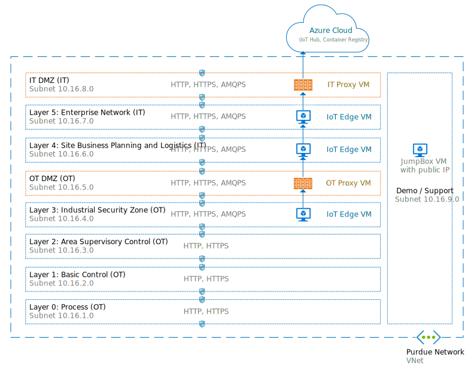
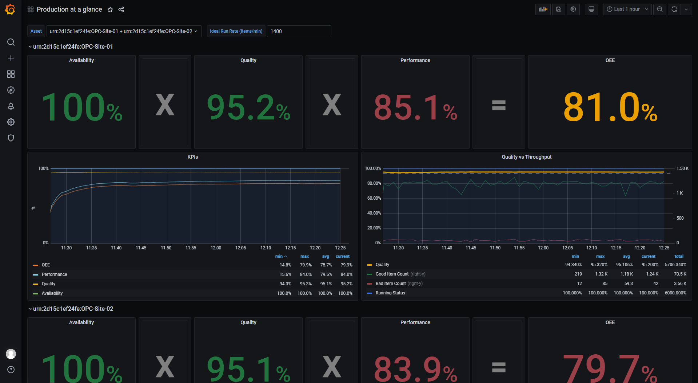

# Azure IoT Edge for Industrial IoT
###### 2 parts - 60 mins

This sample shows how to use a hierarchy of IoT Edge devices in a industrial environment to extract data from industrial assets, visualize it offline and upload it to the Cloud.

Manufacturing networks are often organized in hierarchical layers following the [Purdue network model](https://en.wikipedia.org/wiki/Purdue_Enterprise_Reference_Architecture) (included in the [ISA 95](https://en.wikipedia.org/wiki/ANSI/ISA-95) and [ISA 99](https://www.isa.org/standards-and-publications/isa-standards/isa-standards-committees/isa99) standards). In these networks, only the top layer has connectivity to the cloud and the lower layers in the hierarchy can only communicate with adjacent north and south layers.

In a first part, we'll simulate in Azure a Purdue network, industrial assets and a hierarchy of IoT Edge gateways to acquire industrial data and upload it to the cloud securely without compromising the security of the network.

In a second part, we'll remotely deploy workloads to IoT Edge devices in order to 1/collect data from industrial assets over [OPC UA](https://opcfoundation.org/about/opc-technologies/opc-ua/) with [OPC Publisher](https://azuremarketplace.microsoft.com/marketplace/apps/microsoft_iot.iotedge-opc-publisher?tab=Overview), 2/store this data in a local [SQL Edge](https://azure.microsoft.com/services/sql-edge/) database and 3/visualize this data locally even when offline. We'll build these workloads using a [CI/CD](https://wikipedia.org/wiki/CI/CD) pipeline with [Azure DevOps](https://azure.microsoft.com/services/devops/).

## Get started
1. [Simulate an Purdue network, industial assets and a hierarchy of IoT Edge devices](1-SimulatePurdueNetwork.md) (30 mins)
2. [Deploy workloads to collect, store and visualize data from industrial assets](2-DeployOfflineDashboard.md) (30 mins)

 
 
 

---

 

## Contributing

The project welcomes contributions and suggestions.  Most contributions require you to agree to a
Contributor License Agreement (CLA) declaring that you have the right to, and actually do, grant us
the rights to use your contribution. For details, visit https://cla.opensource.microsoft.com.

When you submit a pull request, a CLA bot will automatically determine whether you need to provide
a CLA and decorate the PR appropriately (e.g., status check, comment). Simply follow the instructions
provided by the bot. You will only need to do this once across all repos using our CLA.

This project has adopted the [Microsoft Open Source Code of Conduct](https://opensource.microsoft.com/codeofconduct/).
For more information see the [Code of Conduct FAQ](https://opensource.microsoft.com/codeofconduct/faq/) or
contact [opencode@microsoft.com](mailto:opencode@microsoft.com) with any additional questions or comments.
