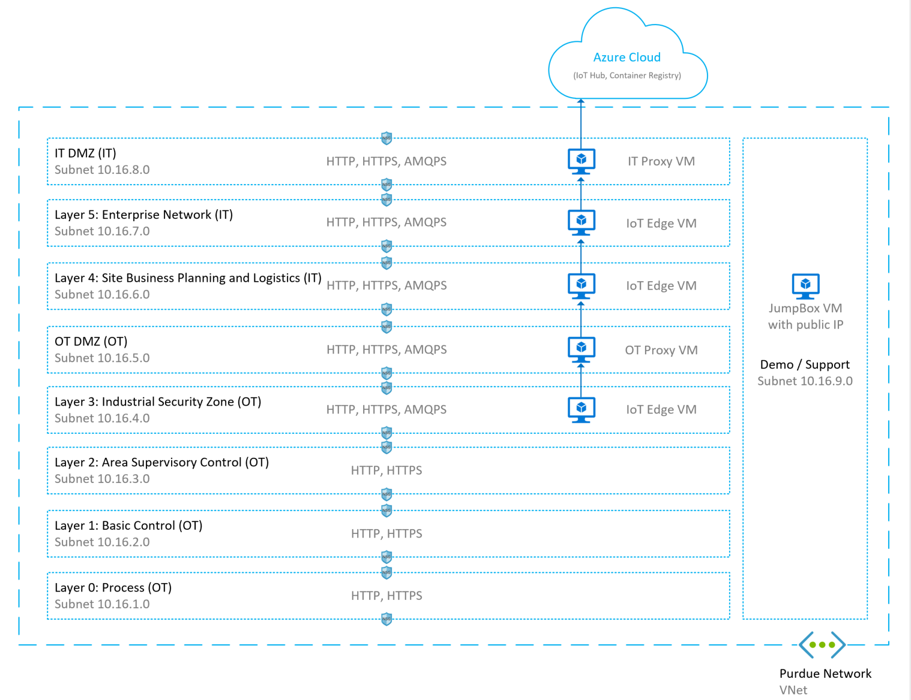
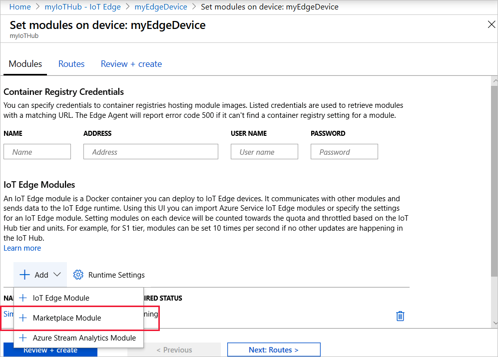
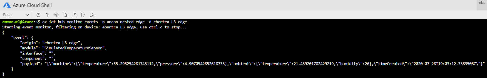

# Azure IoT Edge for Industrial IoT

This sample shows how to use a hierarchy of IoT Edge devices in a industrial environment to extract data from industrial assets and upload it to the Cloud.

Manufacturing networks are often organized in hierarchical layers following the [Purdue network model](https://en.wikipedia.org/wiki/Purdue_Enterprise_Reference_Architecture) (included in the [ISA 95](https://en.wikipedia.org/wiki/ANSI/ISA-95) and [ISA 99](https://www.isa.org/standards-and-publications/isa-standards/isa-standards-committees/isa99) standards). In these networks, only the top layer has connectivity to the cloud and the lower layers in the hierarchy can only communicate with adjacent north and south layers.

In this sample, we will simulate in Azure a Purdue network, industrial assets and a hierarchy of IoT Edge gateways to acquire industrial data and upload it to the cloud securely without compromising the security of the network.

## Pre-requisites

- An **Azure account with a valid subscription**. When using the default simulation configuration, 6 Virtual Machines and 1 Virtual Network (VNet) will be deployed in your subscription for a daily cost of **$3.03** and an additional **$2.00** per 100Gb inbound and outbound used in the VNet. For more details, see this [Azure Pricing Estimate](https://azure.com/e/4df47d47440b43e78076078496e2c3d1).
- An **IoT Hub** that supports IoT Edge devices (SKU F1 --which is free--, S1, S2 or S3).
- An **SSH client**.
- **[Azure CLI](https://docs.microsoft.com/en-us/cli/azure/?view=azure-cli-latest) with the nested edge preview `azure-iot` CLI extension** installed. We'll use the [Azure Cloud Shell](https://docs.microsoft.com/en-us/azure/cloud-shell/overview) in this tutorial for which only a browser is needed.
    1. Open the [Azure Cloud Shell](https://shell.azure.com/) from your browser
    2. If you're using [Azure Cloud Shell](https://shell.azure.com/) for the first time, you'll be prompted to select a subscription to create a storage account and a Microsoft Azure Files share. Select Create storage to create a storage account for your Cloud Shell session information. This storage account is separate from resources used in this tutorial.
    3. To install the nested edge preview `azure-iot` CLI extension in your Azure Cloud Shell
        - Make sure that you're running the latest Azure CLI:

            ```bash
            az upgrade
            ```

        - Remove the `azure-iot` extension if it was already installed:

            ```bash
            az extension list-available --output table | grep azure-iot
            az extension remove --name azure-iot
            ```

        - Install the nested edge preview `azure-iot` extension:

            ```bash
            wget -O azure_iot-0.0.7rc1-py3-none-any.whl "https://iotedgeforiiot.blob.core.windows.net/cli-public-preview/azure_iot-0.0.7rc1-py3-none-any.whl"
            az extension add --source azure_iot-0.0.7rc1-py3-none-any.whl
            ```

        - Verify successful installation by running a test command:

            ```bash
            az iot hub list --hub-name <iothub_name>
            ```

    4. Verify that your are using the right subscription:

        ```bash
        az account show
        ```

## Simulate a Purdue network and a hierarchy of IoT Edge devices

### Deploy the simulation

To simulate a factory, the following scripts automate the deployment of a Purdue network, industrial assets and a hierarchy of IoT Edge gateways to acquire industrial data and upload their data securely without compromising the security of the Purdue Network.

<!-- TODO1: Add picture of Purdue network -->


From the [Azure Cloud Shell](https://shell.azure.com/):

- Download the scripts:

    ```bash
    git clone https://github.com/ebertrams/iotedge4iiot-e2e.git
    ```

- Give execution permissions to these script:

    ```bash
    cd ./iotedge4iiot-e2e
    find  -name '*.sh' -print0 | xargs -0 chmod +x
    ```

- Configure your simulation or keep the default one that deploys 3 IoT Edge devices in layers L5, L4 and L3:

    ```bash
    nano config.txt
    ```

    Here are some notes if you want to change the default configuration:

    - The network structure cannot be changed
    - Add IoT Edge devices in each layer by listing out additional IoT Edge device names separated by a space
    - Define their parents by appending their parent name under parenthesis
    - Follow the naming restrictions listed in the configuration file header
    - Modify deployment files that go through each layers

    We'll assume that you're using the default configuration in the rest of this sample.

- Deploy the simulation (~15 minutes):

    ```bash
    ./install.sh -rg=<resource_group_prefix> -l=<location> -hubrg=<iothub_resource_group> -hubname=<iothub_name>
    ```

    The installation script deploys the following resources:

    - A Virtual Network (VNet) with one subnet per layer and network security rules enforcing the Purdue Model restrictions.
    - One Virtual Machine (VM) for the jumpbox, the observation point to access any devices on the network.
    - Two VMs running HTTP forward proxies: one in the IT DMZ and one in the OT DMZ.
    - One VM per IoT Edge device listed in the configuration file, e.g. 3 by default.

    The remainder of the installation scripts provisions the IoT Edge devices in your IoT hub, configures the IoT Edge devices by installing test certificates and updating their IoT Edge configuration files, locks down the network so that VMs no longer have internet access once they are done with their configuration scripts (that comes from the internet) and finally deploys base workloads to IoT Edge devices via IoT hub.

    By default, *Azure VM B1ms* are used for all the VMs, e.g. 1vCPU, 2Gb RAM, 4GB storage VMs. To simulate heavy loads, upgrade to more powerful VMs by passing the *vmSize* parameters to the installation script.

    Take note of all the outputs of the installation scripts since it lists key information on your network structure and on access information for all your VMs.

- Monitor your deployment. For each IoT Edge device, verify that after a couple of minutes all their modules are in `runningStatus` reported as `running`. Either by looking at your IoT Edge devices in t[he Azure portal](https://ms.portal.azure.com/?feature.canmodifystamps=true&Microsoft_Azure_Iothub=development#home) or by running the following Azure CLI command:

    ```
    az iot hub module-twin show --device-id <edge_device_id> --module-id '$edgeAgent' --hub-name <iot_hub_name> --query "properties.reported.[systemModules, modules]"
    ```

You now have a Purdue network simulated in Azure along with some IoT Edge devices deployed through a couple layers with a base deployment.

### Access your devices

Even though you should not need to directly access your IoT Edge devices, it may be convenient to do so just for education purposes. Given that the Purdue network is isolated from the Internet, an observation point has been added to this network to access devices. This observation point is called a jumpBox and it enables you to access any devices on the network. The jumpBox is not part of the Purdue model and has only been added for education purposes.

To access a device in the network, first connect to the jumpBox via SSH and from there connect to any other device on the network via SSH again. All the credentials and SSH handlers are provided by the installation script so that you only need to copy / paste values from there.

From your favorite SSH client:

- Connect to your Jumpbox:

    ```bash
    <jumpbox_ssh_handle_from_the_installation_script>
    ```

- Connect to any other device on the network:

    ```bash
    <iot_edge_device_ssh_handle_from_the_installation_script>
    ```

## Add your workloads

To deploy your additional workloads on an IoT Edge device, you can use the standard tools available to deploy an IoT Edge module: [Portal](https://docs.microsoft.com/en-us/azure/iot-edge/how-to-deploy-modules-portal), [CLI](https://docs.microsoft.com/en-us/azure/iot-edge/how-to-deploy-modules-cli), [VS Code](https://docs.microsoft.com/en-us/azure/iot-edge/how-to-deploy-modules-vscode).

As an example, we'll add this [Simulated Temperature Sensor](https://azuremarketplace.microsoft.com/en-us/marketplace/apps/azure-iot.simulated-temperature-sensor?tab=Overview) module to the `L3-edge` device from the above sample using the Azure Portal:

- Open and sign-in into the [Azure Portal](http://portal.azure.com)
- Navigate to your IoT Hub.
- On the left pane, under **Automatic Device Management**, select **IoT Edge**.
- Select `L3-edge` the IoT Edge device that is to receive the deployment.
- On the upper bar, select **Set Modules**.
- In the **IoT Edge Modules** section, click **Add**, and select **Marketplace Module** from the drop-down menu.



- Choose the **Simulated Temperature Sensor** module from the IoT Edge Module Marketplace page.
- Click on its name to edit its settings
- Under *Module Settings*, replace its **imageURI** to `$upstream:443/azureiotedge-simulated-temperature-sensor:1.0`
- Click on **Review+Create** and **Confirm**

An updated deployment is now on-going for `L3-edge` device.

Note: The Simulated Temperature Sensor only sends 500 messages by default. To change this behavior, set the environment variable `MessageCount` to the number of messages that should be sent or to `-1` to send messages indefinitely.

## View generated data

In this sample, you've created a hierarchy of IoT Edge devices across a Purdue network organized in hierarchical layers where only the top layer has connectivity to the cloud and the lower layers in the hierarchy can only communicate with adjacent north and south layers. Then, you've remotely deployed the **Simulated Temperature Sensor** module that sends simulated data from the lowest layer.

To view thi simulated data makes its way through the device hierarchy all the way up to the cloud, start monitoring the messages received by the cloud coming from the device in your lowest layer `L3-edge`. From the [Azure Cloud Shell](https://shell.azure.com/):

```bash
az iot hub monitor-events -n <iothub_name> -d L3-edge
```



## Clean up

To clean up all the resources that you've deployed in Azure including the IoT Edge devices in your IoT hub created for this simulation, run the following script from the [Azure Cloud Shell](https://shell.azure.com/) (it may take a while):

```bash
./uninstall.sh -rg=<resource_group_prefix> -hubrg=<iothub_resource_group> -hubname=<iothub_name>
```
