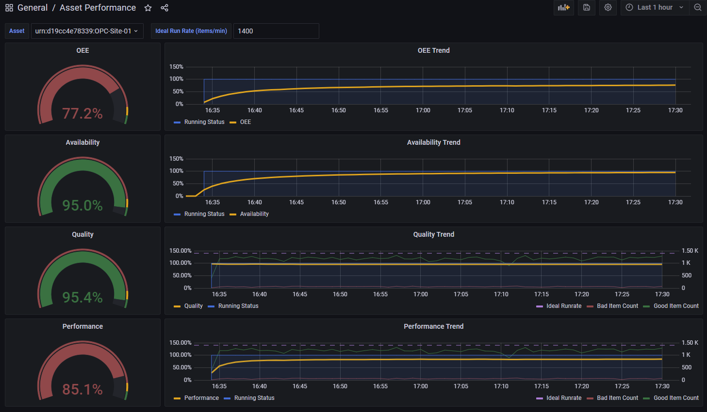
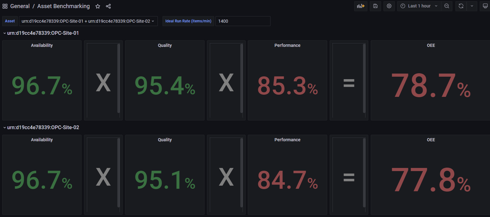
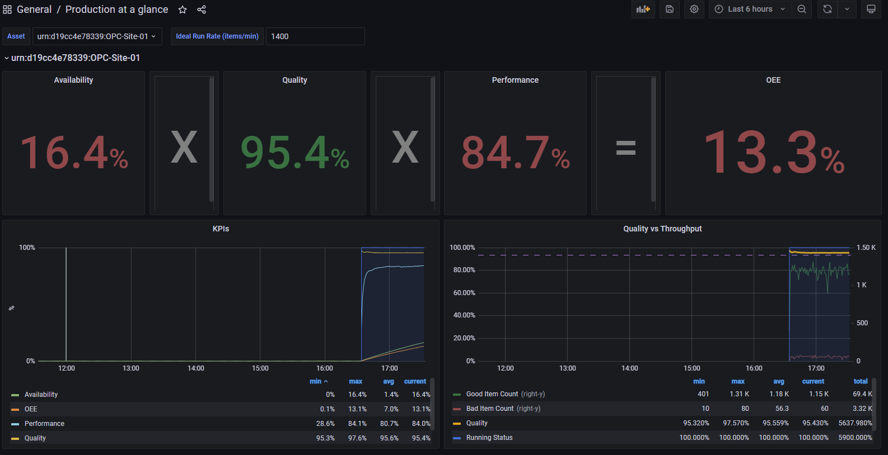

# Flux Query Reference
## Asset Performance

### OEE
```SQL
select a.[time],[Availability]*[Quality]*[Performance] as OEE 
from GetAvailability($__timeFrom(), $__timeTo(), '$Asset', 0) a 
join GetQuality($__timeFrom(), $__timeTo(), '$Asset', 0) q on (a.[time]=q.[time])
join GetPerformance($__timeFrom(), $__timeTo(), '$Asset', $idealRunrate, 0) p on (a.[time]=p.[time])
```
### OEE History
```SQL
select [time],[Running Status] from GetStatus($__timeFrom(), $__timeTo(), '$Asset') order by [time]

select a.[time],[Availability]*[Quality]*[Performance] as OEE 
from GetAvailability($__timeFrom(), $__timeTo(), '$Asset', 1) a 
join GetQuality($__timeFrom(), $__timeTo(), '$Asset', 1) q on (a.[time]=q.[time])
join GetPerformance($__timeFrom(), $__timeTo(), '$Asset', $idealRunrate, 1) p on (a.[time]=p.[time])
order by [time]
```
### Availability
```SQL
select [time],[Availability] from GetAvailability($__timeFrom(), $__timeTo(), '$Asset', 0)
```
### Availability History
```SQL
select [time],[Running Status] from GetStatus($__timeFrom(), $__timeTo(), '$Asset') order by [time]

select [time],[Availability] from GetAvailability($__timeFrom(), $__timeTo(), '$Asset', 1) order by [time]
```
### Quality
```SQL
select [time],[Quality] from GetQuality($__timeFrom(), $__timeTo(), '$Asset', 0)
```

### Quality History
```SQL
select [time], ItemCount as [Good Item Count] from GetItemCounts($__timeFrom(), $__timeTo(), '$Asset', 1,1) order by [time]

select [time], ItemCount as [Bad Item Count] from GetItemCounts($__timeFrom(), $__timeTo(), '$Asset', 0,1) order by [time]

select [time], [Quality] from GetQuality($__timeFrom(), $__timeTo(), '$Asset', 1) order by [time]

select [time],[Running Status] from GetStatus($__timeFrom(), $__timeTo(), '$Asset') order by [time]

select convert(datetime2, $__timeFrom()) as [time], $idealRunrate as [Ideal Runrate]
union ALL
select convert(datetime2, $__timeTo()) as [time], $idealRunrate as [Ideal Runrate]
```
### Performance
```SQL
select [time],[Performance] from GetPerformance($__timeFrom(), $__timeTo(), '$Asset', $idealRunrate, 0)
```
### Performance History
```SQL
select [time], ItemCount as [Good Item Count] from GetItemCounts($__timeFrom(), $__timeTo(), '$Asset', 1,1) order by [time]

select [time], ItemCount as [Bad Item Count] from GetItemCounts($__timeFrom(), $__timeTo(), '$Asset', 0,1) order by [time]

select [time], [Performance] from GetPerformance($__timeFrom(), $__timeTo(), '$Asset', $idealRunrate, 1) order by [time]

select [time],[Running Status] from GetStatus($__timeFrom(), $__timeTo(), '$Asset') order by [time]

select convert(datetime2, $__timeFrom()) as [time], $idealRunrate as [Ideal Runrate]
union ALL
select convert(datetime2, $__timeTo()) as [time], $idealRunrate as [Ideal Runrate]
```

## Asset Benchmark


### Availability
```SQL
select [time],[Availability] from GetAvailability($__timeFrom(), $__timeTo(), $Asset, 0)
```
### Quality
```SQL
select [time],[Quality] from GetQuality($__timeFrom(), $__timeTo(), $Asset, 0)
```
### Performance
```SQL
select [time],[Performance] from GetPerformance($__timeFrom(), $__timeTo(), $Asset,$idealRunrate, 0)
```
### OEE
```SQL
select a.[time],[Availability]*[Quality]*[Performance] as OEE 
from GetAvailability($__timeFrom(), $__timeTo(), $Asset, 0) a 
join GetQuality($__timeFrom(), $__timeTo(), $Asset, 0) q on (a.[time]=q.[time])
join GetPerformance($__timeFrom(), $__timeTo(), $Asset, $idealRunrate, 0) p on (a.[time]=p.[time])
```

## Production at a Glance

### Availability
```SQL
select [time],[Availability] from GetAvailability($__timeFrom(), $__timeTo(), $Asset, 0)
```
### Quality
```SQL
select [time],[Quality] from GetQuality($__timeFrom(), $__timeTo(), $Asset, 0)
```
### Performance
```SQL
select [time],[Performance] from GetPerformance($__timeFrom(), $__timeTo(), $Asset,$idealRunrate, 0)
```
### OEE
```SQL
select a.[time],[Availability]*[Quality]*[Performance] as OEE 
from GetAvailability($__timeFrom(), $__timeTo(), $Asset, 0) a 
join GetQuality($__timeFrom(), $__timeTo(), $Asset, 0) q on (a.[time]=q.[time])
join GetPerformance($__timeFrom(), $__timeTo(), $Asset, $idealRunrate, 0) p on (a.[time]=p.[time])
```
### KPIs
```SQL
select a.[time],[Availability],[Quality],[Performance],[Availability]*[Quality]*[Performance] as OEE 
from GetAvailability($__timeFrom(), $__timeTo(), $Asset, 1) a 
join GetQuality($__timeFrom(), $__timeTo(), $Asset, 1) q on (a.[time]=q.[time])
join GetPerformance($__timeFrom(), $__timeTo(), $Asset, $idealRunrate, 1) p on (a.[time]=p.[time])

select [time],[Running Status] from GetStatus($__timeFrom(), $__timeTo(), $Asset) order by [time]
```
### Quality vs Throughput
```SQL
select [time], ItemCount as [Good Item Count] from GetItemCounts($__timeFrom(), $__timeTo(), $Asset, 1,1) order by [time]

select [time], ItemCount as [Bad Item Count] from GetItemCounts($__timeFrom(), $__timeTo(), $Asset, 0,1) order by [time]

select [time], [Quality] from GetQuality($__timeFrom(), $__timeTo(), $Asset, 1) order by [time]

select [time],[Running Status] from GetStatus($__timeFrom(), $__timeTo(), $Asset) order by [time]

select convert(datetime2, $__timeFrom()) as [time], $idealRunrate as [Ideal Runrate]
union ALL
select convert(datetime2, $__timeTo()) as [time], $idealRunrate as [Ideal Runrate]
```


## Support Functions
```SQL
Create Function [dbo].[GetRunningStatus](@assetStatus as DECIMAL(28, 5)) Returns smallint
As
Begin
declare @runningstatus smallint
if (@assetStatus in 
    (
        cast(101.0 as DECIMAL(28, 5)),
        cast(105.0 as DECIMAL(28, 5)),
        cast(108.0 as DECIMAL(28, 5))
    )
   )           
    set @runningstatus= 1;
ELSE
    set @runningstatus= 0;

return @runningstatus
End

GO
create view StatusData as select [time], Value as [Status], Asset from DeviceData where DataPoint=N'STATUS'
GO
create view RunStatusData as select [time], dbo.GetRunningStatus(Status) as [Running Status], Asset from StatusData 
GO
CREATE FUNCTION TimeValues(@fromDate datetime2, @toDate datetime2)
    RETURNS @timeValues TABLE (Timestamp datetime2)
AS
BEGIN
    DECLARE @currentTimestamp as DATETIME2,
            @beginTimestamp as DATETIME2 = @fromDate,
            @endTimestamp as DATETIME2 = @toDate,
            @incrementSeconds as int = 60
    if(datediff(minute,@beginTimestamp,@endTimestamp)>100000) return; --precaution against errorenous parameters
    set @currentTimestamp = @beginTimestamp
    while @currentTimestamp < @endTimestamp
    begin
        insert into @timeValues (Timestamp) values (Date_Bucket(minute, 1 ,@currentTimestamp))
        set @currentTimestamp = dateadd(second, @incrementSeconds,@currentTimestamp)
    end
    RETURN;
END
GO
create function GetAvailability(@fromDate datetime2, @toDate datetime2, @asset nvarchar(200), @with_history smallint=1)
    RETURNS @availability TABLE ([time] datetime2, [Availability] decimal(15,4), RunningMins decimal(15,4), TotalMins decimal(15,4), [Running Status] smallint)
AS
BEGIN

declare @temp table ([time] datetime2 primary key, [Running Status] decimal(15,4))

insert into @temp
select t.[Timestamp] as [time], r2.[Running Status]
from
(
    select Date_Bucket(mi, 1 ,[time]) as [time], Sum([Running Status]) as [Running Status] from
    (
        SELECT top 1 [Running Status],@fromDate as [time] from RunStatusData WHERE [time] < @fromDate AND Asset=@asset order by [time] desc 
        union all
        SELECT [Running Status],[time] from RunStatusData r WHERE r.[time] BETWEEN @fromDate AND @toDate AND r.Asset=@asset
    ) r1
    group by Date_Bucket(mi, 1 ,[time])
) r2 right join TimeValues(@fromDate,@toDate) t on ( t.[Timestamp]=r2.[time])

update t
SET t.[Running Status] = (select top 1 [Running Status] from @temp t1 where t1.time<t.time and t1.[Running Status] is not null order by time desc)
from @temp t
where t.[Running Status] is NULL


if @with_history=1  
    insert into @availability 
    select [time],
    convert(decimal(15,4), sum(case when [Running Status]=1 then 1 else 0 end) over (order by [time]))/convert(decimal(15,4),count(*) over (order by [time])) as [Availability],
    convert(decimal(15,4), sum(case when [Running Status]=1 then 1 else 0 end) over (order by [time])) as RunningMins,
    count(*) over (order by [time]) as TotalMins,
    [Running Status]
    from @temp 
else 
    insert into @availability 
    select Date_Bucket(minute, 1 ,@toDate) as [time],
    convert(decimal(15,4), sum(case when [Running Status]=1 then 1 else 0 end))/convert(decimal(15,4),count(*) ) as [Availability],
    convert(decimal(15,4), sum(case when [Running Status]=1 then 1 else 0 end)) as RunningMins,
    count(*)  as TotalMins,
    null as [Running Status] --irrelevant without trend data
    from @temp 
    
RETURN
END
GO
create function GetItemCounts(@fromDate datetime2, @toDate datetime2, @asset nvarchar(200), @get_good_count_data smallint, @with_history smallint=1)
    RETURNS @itemcounts TABLE ([time] datetime2, [ItemCount] DECIMAL(28, 5))
AS
BEGIN

if (@with_history=1)
insert into @itemcounts
    select t.[Timestamp] as [time], r2.[Value] as [ItemCount]
    from
    (
    select Date_Bucket(mi, 1 ,[time]) as [time], Sum(Value) as [Value] 
    from DeviceData r WHERE r.[time] BETWEEN @fromDate AND @toDate AND r.Asset=@asset and ((@get_good_count_data=1 and DataPoint='ITEM_COUNT_GOOD') or (@get_good_count_data=0 and DataPoint='ITEM_COUNT_BAD')) 
    group by Date_Bucket(mi, 1 ,[time])
    ) r2 right join TimeValues(@fromDate,@toDate) t on ( t.[Timestamp]=r2.[time])
ELSE
insert into @itemcounts
    select Date_Bucket(mi, 1 ,@toDate) as [time], Sum(Value) as [ItemCount] 
    from DeviceData r WHERE r.[time] BETWEEN @fromDate AND @toDate AND r.Asset=@asset and ((@get_good_count_data=1 and DataPoint='ITEM_COUNT_GOOD') or (@get_good_count_data=0 and DataPoint='ITEM_COUNT_BAD')) 

RETURN
END

GO
create function GetPerformance(@fromDate datetime2, @toDate datetime2, @asset nvarchar(200), @idealRunrate as decimal(28,5), @with_history smallint=1)
    RETURNS @performance TABLE ([time] datetime2, [Performance] decimal(15,4))
AS
BEGIN
insert into @performance
    select good.[time] as [time], 
    (sum(good.ItemCount) over (order by good.[time]))/(avail.RunningMins)/@idealRunrate as Performance
    from GetItemCounts(@fromDate, @toDate, @asset,1,@with_history ) good join GetAvailability(@fromDate, @toDate, @asset,@with_history ) avail on (good.[time]=avail.[time])
RETURN
END

GO
create function GetQuality(@fromDate datetime2, @toDate datetime2, @asset nvarchar(200), @with_history smallint=1)
    RETURNS @quality TABLE ([time] datetime2, [Quality] decimal(15,4))
AS
BEGIN
insert into @quality
    select good.[time] as [time], 
    (sum(good.ItemCount) over (order by good.[time]))/((sum(good.ItemCount) over (order by good.[time]))+(sum(bad.ItemCount) over (order by good.[time]))) as Quality
    from GetItemCounts(@fromDate, @toDate, @asset,1,@with_history ) good join GetItemCounts(@fromDate, @toDate, @asset,0,@with_history ) bad on (good.[time]=bad.[time])
RETURN
END

GO
create function GetStatus(@fromDate datetime2, @toDate datetime2, @asset nvarchar(200))
    RETURNS @status TABLE ([time] datetime2, [Running Status] smallint)
AS
BEGIN
insert into @status
select time, [Running Status]
from GetAvailability(@fromDate,@toDate,@asset,1)    
RETURN
END
GO
```

## Table Schema

```SQL
CREATE TABLE [dbo].[DeviceData]
(
    [ContentMask] NVARCHAR(255) NULL, 
    [NodeId] NVARCHAR(255) NULL, 
    [ServerTimestamp] DATETIME2 NULL, 
    [SourceTimestamp] DATETIME2 NULL, 
    [StatusCode] NVARCHAR(255) NULL, 
    [Status] NVARCHAR(255) NULL, 
    [ApplicationUri] NVARCHAR(255) NULL, 
    [Timestamp] DATETIME2 NULL, 
    [ValueType] INT NULL, 
    [time] DATETIME2 NOT NULL, 
    [Value] DECIMAL(28, 5) NULL, 
    [DataPoint] NVARCHAR(200) NOT NULL, 
    [Asset] NVARCHAR(200) NOT NULL, 
    CONSTRAINT [pk_devicedata] PRIMARY KEY ([DataPoint], [Asset], [time])
)
```
